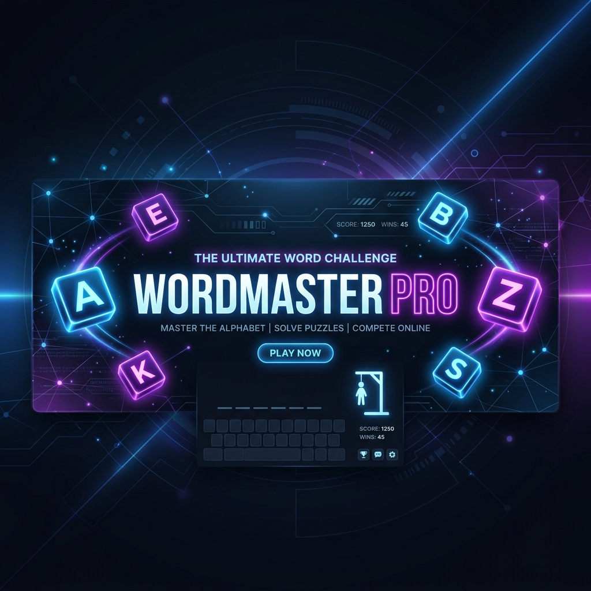
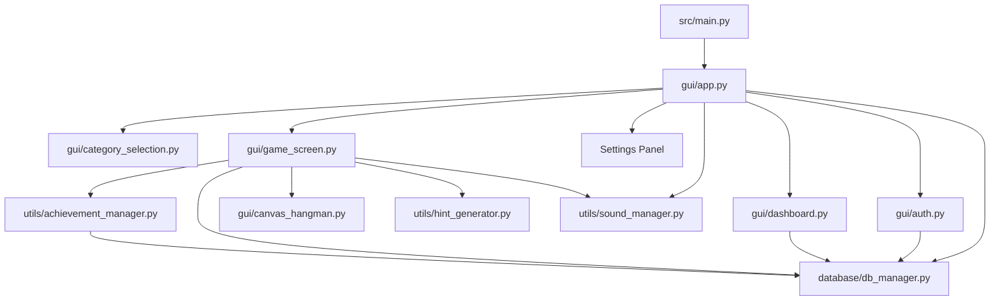

# WordMaster Pro – Interactive Guessing Arena



<div align="center">


</div>

---

**WordMaster Pro** is a premium, feature-rich word-guessing arena and interactive desktop game built with Python, CustomTkinter, and SQLite. Featuring a modern, high-contrast dark theme, sound synthesis, persistent profile metrics, daily streaks, local multiplayer, and custom word pack imports, it transforms the classic hangman game into a sleek, gamified learning experience.

---

## 🌟 Key Features

*   🎮 **Three Distinct Play Modes**:
    *   **Standard Arena**: Choose from five default categories (*Technology, Sports, Movies, Science, General Knowledge*) across three difficulty levels (*Easy, Medium, Hard*).
    *   **Daily Challenge**: Log in every day to play a curated word, earn high stakes, and build a persistent daily streak.
    *   **Custom Multiplayer**: Allow a local buddy to type in a secret word and custom hint, then challenge you to guess it.
*   🎨 **Dynamic Canvas Drawing & Themes**:
    *   Features a responsive visual canvas drawing of the hangman step-by-step.
    *   Fully adapts to Theme shifts. Toggle seamlessly between Dark and Light visual appearance modes without losing progress.
*   📊 **Analytics Dashboard & Leaderboard**:
    *   View key statistics including total score, win rate, played matches, and category/difficulty distribution.
    *   Compare your score with other profiles in the SQLite Database via the global Top 10 Leaderboard.
*   🏆 **Achievement System**:
    *   Earn coins and unlock specific achievements based on accomplishments (e.g., *Flawless* for zero wrong guesses, *Hardcore* for winning on Hard mode, or *Knowledge Seeker* for winning in all default categories).
*   🔊 **Synthesized Audio Engine**:
    *   Programmatic audio synthesis: if sound files are missing at first boot, the game automatically synthesizes lossless 16-bit WAV tones.
    *   Audio mixer integration with volume slider control and mute toggles directly from the settings panel.

---

## 🏗️ Codebase Architecture

The application is modularized into distinct separation of concerns, dividing GUI components, storage logic, and utility managers:



### File Navigator (Workspace Links)

*   🚀 **Entrypoint**: [src/main.py](file:///d:/python/src/main.py) — Initializes schemas, builds default assets, and boots the CustomTkinter thread.
*   🖥️ **GUI Components**:
    *   [gui/app.py](file:///d:/python/src/gui/app.py) — Main layout controller, theme toggle, volume settings, and tab navigation.
    *   [gui/auth.py](file:///d:/python/src/gui/auth.py) — Login and Registration forms with password hashing (SHA-256 with salts).
    *   [gui/dashboard.py](file:///d:/python/src/gui/dashboard.py) — Visual player profile card, score statistics, achievements badge drawer, and leaderboard.
    *   [gui/category_selection.py](file:///d:/python/src/gui/category_selection.py) — Difficulty slider, category pills, and challenge routes.
    *   [gui/game_screen.py](file:///d:/python/src/gui/game_screen.py) — The main gameplay loop, handling on-screen keyboard, guesses, timing, and database uploads.
    *   [gui/canvas_hangman.py](file:///d:/python/src/gui/canvas_hangman.py) — Sub-frame drawing vector hangman states dynamically.
    *   [gui/multiplayer.py](file:///d:/python/src/gui/multiplayer.py) — Form validating custom words and hints.
*   💾 **Database & Persistence**:
    *   [database/db_manager.py](file:///d:/python/database/db_manager.py) — Schema scripts, seed databases, transaction APIs for recording wins, coins, streaks, and achievements.
*   🛠️ **Core Utilities**:
    *   [utils/sound_manager.py](file:///d:/python/src/utils/sound_manager.py) — Mathematical tone generator using `struct` and `wave` modules, mapped to a `pygame` sound mixer wrapper.
    *   [utils/achievement_manager.py](file:///d:/python/src/utils/achievement_manager.py) — Static evaluator verifying if conditions for badges are met.
    *   [utils/hint_generator.py](file:///d:/python/src/utils/hint_generator.py) — Generates contextual word hints.
*   🧪 **Unit Testing**:
    *   [tests/test_db.py](file:///d:/python/tests/test_db.py) — SQLite integration tests.

---

## 🗃️ Database Schema

The database `database/wordmaster.db` is built automatically on startup and holds the following structure:

| Table | Primary Key | Description / Purpose |
| :--- | :--- | :--- |
| **`users`** | `id` | Authenticated users, storing usernames and salted SHA-256 passwords. |
| **`user_profiles`** | `user_id` | Profile settings (avatar color badge, coin counts, daily streak counter). |
| **`scores`** | `id` | Gameplay scores, difficulty, and category details for dashboard statistics. |
| **`achievements`** | `id` | Master list of all unlockable badges in the application. |
| **`user_achievements`** | `(user_id, achievement_id)` | Many-to-many relationship mapping unlocked achievements per player. |
| **`words`** | `id` | Word bank containing default built-in entries and custom uploaded packs. |
| **`daily_challenges`** | `id` | Generated unique words mapping to each calendar date. |

---

## ⚙️ Installation & Setup

### Prerequisites
- **Python 3.8+**
- **pip** (Python package installer)

### 1. Install Dependencies
Install the required GUI framework and audio dependencies:
```bash
pip install customtkinter pygame
```
*Note: If `pygame` is not installed, the audio engine will gracefully fall back to silent execution without crashing.*

### 2. Run the Application
Start the main loop from the root directory:
```bash
python src/main.py
# Or on Windows if 'python' is not globally in PATH:
py src/main.py
```

### 3. Run Automated Tests
Execute the SQLite database operation checks:
```bash
python -m unittest tests/test_db.py
# Or on Windows:
py -m unittest tests/test_db.py
```

---

## 🎵 Math-Based Audio Synthesis

A unique highlight of this repository is the built-in sound wave generator in [utils/sound_manager.py](file:///d:/python/src/utils/sound_manager.py). Instead of shipping large binary WAV assets, the project constructs high-fidelity tones algorithmically.

For instance, the **Victory Chime** (`win.wav`) blends a sequence of rising tones (C5, E5, G5, C6) with customized sample envelopes to prevent clicking, writing raw binary data directly using the standard Python libraries:

```python
# Programmatic audio generation sample
with wave.open(filepath, 'w') as wav_file:
    wav_file.setparams((1, 2, sample_rate, num_samples, 'NONE', 'not compressed'))
    # math-based wave creation logic...
```

---

## 📝 License
This project is open-source and licensed under the **MIT License**. Feel free to use, modify, and build upon it!
